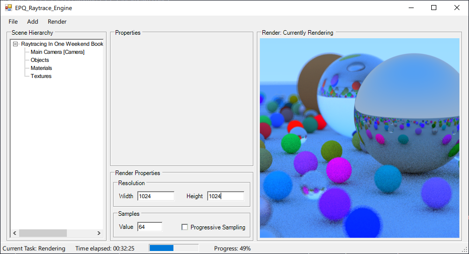
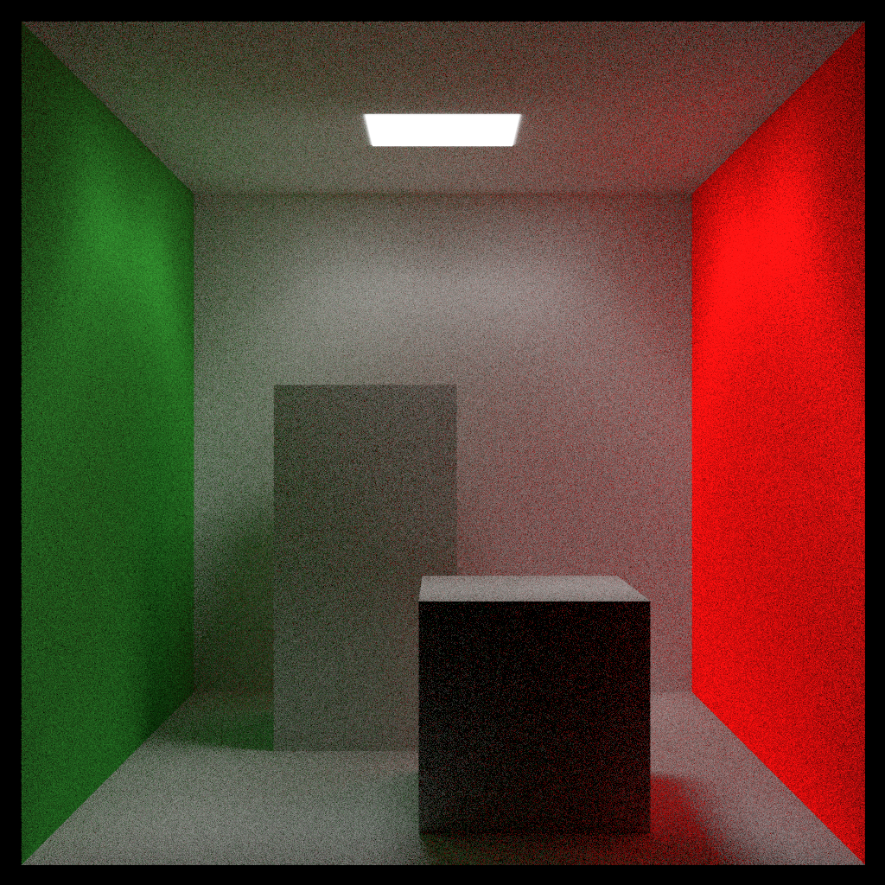

# EPQ Raytracer App

> A raytracing application, largely based on the [Raytracing in One Weekend (Book Series)](https://raytracing.github.io/), for my A-Level (2019-2020 Exam) EPQ (Extended Project Qualification, where you can research your own topic/question). The purpose of this application was to teach myself how a raytracing works in a practical situation. It was originally designed only for hard-coding a scene into the program but I had to add UI quite late into the project, as I had to present the program to people who knew little about programming, let alone raytracing.

***Note:** The program is missing useful, key features since it was my **first C# project**, created for my A-Level coursework and I haven't worked on it since.*

## Screenshots

<h6 align="center">
    
     
     
    Program rendering the "Cornell Box (Simplified)" scene
     
     
     
    
     
     
    Program rendering the "Raytracing In One Weekend Book 1 Cover" scene
</h6>

## Renders

***Note:** Render times are based on single-threaded performance with my AMD Ryzen 2700x (3.7 GHz) CPU. All below renders where done at 1024x1024px resolution.*

|                                                              Scene                                                               |                      Output                      | Samples | Render Time |
|:--------------------------------------------------------------------------------------------------------------------------------:|:------------------------------------------------:|:-------:|:-----------:|
|                                                     Cornell Box (Simplified)                                                     |                |   512   | 1h:15m:48s  |
| [Raytracing In One Weekend Book 1 Cover](https://raytracing.github.io/books/RayTracingInOneWeekend.html#wherenext?/afinalrender) |  |   64    | 1h:07m:20s  |

## Helpful/used resources

- [Raytracing in One Weekend (Book Series)](https://raytracing.github.io/), which this program is heavily based on
- [Scratchapixel](https://www.scratchapixel.com/)

## License

[See license here](https://github.com/arcticnoah/epq-raytracer/blob/main/LICENSE)

## Known issues

- I seemed to have used an older edition of the `Raytracing in One Weekend (Book Series)`, which had a few issues with the code (that I attempted to fix)
- Very little optimisation has been done, hence the very long render times
- Only supports CPU single-thread rendering as my attempt at multi-threading didn't work properly
- The UI is missing various key features and isn't very intuitive, since it was added very last minute
- Sometimes the render will seemingly freeze (the render preview won't update), this is when the UI tries to update the preview but crashes the render thread by accessing the bitmap being used
- Bounding box/AABB isn't implemented since I couldn't get it to work correctly
- Some elements of the scene can be edited and affect the output if its currently rendering (eg. camera options)
- Saving/Loading files isn't implemented since I structured my classes data in an incompatible manner for JSON serialisation and simply didn't have the time to reorganise the code for this functionality (hence the preset scenes via the `File` menu)

## Running/use binary

**[Download Latest Binary Here](https://github.com/arcticnoah/epq-raytracer/releases/latest)**

> The release binary should run on any x64 Windows device that supports .NET Framework 4.7.2

When running the binary, the UI should show with the cornell box scene pre-loaded. You can choose other built-in scenes by going to `File`.

You can add new elements to the scene via the `Add` menu. To remove an element, right click the element in the scene tree and select `Delete Element` (you can't delete element groups, the camera or scene). You can edit an elements properties by selecting it in the scene tree.

To start the render, select `Start Render` from the `Render` menu. You can stop the render whilst its rendering or save the output during/after the render process. 

If you enable `Progressive Sampling`, the renderer will raytrace the scene indefinitely rather than setting a specific sample count per pixel. This option does take longer however.

## How to compile from source

Make sure you have the following installed:

- **Visual Studio 2019** (with the `.NET Framework 4.7.2 SDK`)

Then follow these steps to compile the project:

1.  Clone the repo
2.  In the root folder of the project, open the `EPQ_Raytrace_Engine.sln` file with Visual Studio 2019
3.  Compile/build the program (*Default shortcut:* **F5**)